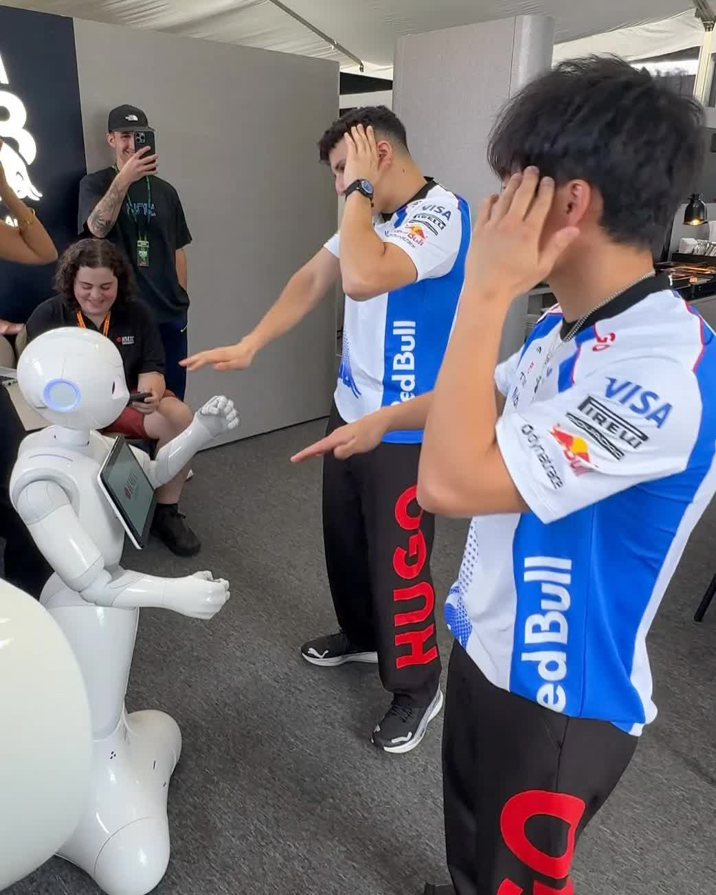

# Haku Control System

A modular control and conversation system for Pepper robots. Haku combines a browser-based operator interface, an on-robot NAOqi handler, streaming speech recognition, and a local language model to support live demonstrations, scripted interactions, and spoken conversations with synchronised gestures.

Manual control works with the web controller and robot handler alone. Speech-to-text (STT) and language-model services add the AI conversation pipeline and can run on a separate workstation from the robot.



## Capabilities

- Control speech, movement, gestures, awareness, and robot state from a React interface.
- Run reusable announcements, shortcuts, and profile-specific interaction scripts.
- Transcribe a local microphone, robot RTP audio, or browser PCM audio into partial and complete utterances.
- Stream language-model responses into speech while preserving embedded behaviour commands and sentence boundaries.
- Coordinate listening and speaking through conversation sessions and robot status updates.
- Display conversation content and media on Pepper's tablet, with heartbeat monitoring and reload commands.
- Use Ollama for local inference; the web controller also includes optional AWS Bedrock integrations.

## System architecture

| Component | Responsibility | Runtime |
| --- | --- | --- |
| [Robot handler](https://github.com/S3942721/pepper-chatbot#readme) | Executes commands, speech, behaviours, motion, state reporting, and audio streaming | Python 2.7 / NAOqi on Pepper |
| [Web controller](https://github.com/S3942721/robo-web-controller/tree/feat/local-llm#readme) | Operator UI, profiles, command routing, conversation sessions, and service integration | Node.js / Express, React / Vite |
| [Speech-to-text](https://github.com/S3942721/haku_stt#readme) | Streaming ASR, punctuation, voice activity and end-of-utterance detection, WebSocket controls | Python 3 / NVIDIA NeMo / PyTorch |
| [Language-model server](https://github.com/S3942721/robo-llm-server#readme) | Ollama container, model lifecycle scripts, and robot-specific prompts | Bash / Docker / Ollama |

The browser communicates with the web controller over HTTP and WebSockets. The robot handler connects to the controller over **plain TCP**, and sends microphone audio to the STT host over **RTP/UDP**. The controller connects to STT over WebSocket and to Ollama over HTTP. Generated responses return to the robot for text-to-speech and behaviour execution; robot status informs conversation turn-taking.

These are Git submodules, so this repository records a specific commit for each service rather than duplicating their source. The configured update branches are `main` for the handler, STT, and LLM repositories, and `feat/local-llm` for the web controller. That feature branch contains integration work that differs from the controller's `main` branch.

## Requirements

- A Pepper robot with its Python 2.7 NAOqi runtime, SSH access, and the behaviours used by your scripts installed.
- A controller host with Node.js 22 LTS and pnpm; install both backend and frontend dependencies.
- For local AI conversations: a Python 3.10 STT environment and a Docker host with an NVIDIA GPU and the NVIDIA Container Toolkit for the supplied Ollama launcher.
- Reachable addresses between the robot and service hosts. The services may share a workstation, but `localhost` on Pepper refers to Pepper itself.

The included [environment.yml](environment.yml) is a Linux Conda environment export for STT development. It includes machine-specific package builds, mixed CUDA/PyTorch dependencies, and an absolute `prefix`; it is a reference snapshot rather than a portable, guaranteed installation recipe. See the STT README for a focused setup path.

## Get the source

```bash
git clone --recurse-submodules https://github.com/S3942721/haku_control_system.git
cd haku_control_system
```

For an existing checkout, initialise the commits recorded by this repository:

```bash
git submodule sync --recursive
git submodule update --init --recursive
```

See each component README for standalone cloning and development instructions.

## Start the system

Use a separate terminal for each long-running service. The examples use `192.168.1.100` for Pepper and `192.168.1.10` for a workstation hosting the controller, STT, and Ollama; substitute your own addresses.

### 1. Prepare the web controller

```bash
cd web-controller
cp example.env .env
pnpm install
pnpm --dir frontend install
```

Edit `.env` before starting. For a local AI setup on one workstation, the key values are:

```dotenv
SERVER_HOST=0.0.0.0
SERVER_PORT=3000
SOCKET_PORT=3456
LLM_PROVIDER=ollama
OLLAMA_HOST=127.0.0.1
OLLAMA_PORT=11434
OLLAMA_MODEL=Haku
STT_SERVER_HOST=127.0.0.1
STT_SERVER_PORT=8765
STT_LLM_ENABLED=true
ROBOT_IDENTIFICATION_METHOD=socket
DEFAULT_ROBOT_NAME=Haku
```

The Ollama helper scripts use `Haku` as the model name, while the controller's example configuration uses `haku`; set the controller to the name returned by Ollama's model list. Disable Nova Sonic in `web-controller/settings/nova-sonic-config.json` if you are using only the local pipeline.

For manual control, STT and Ollama may remain stopped; their unavailable status does not provide AI conversation. `STT_DISABLED=true` hides STT from the advertised network configuration, but does not disable every background STT connection attempt.

### 2. Start Ollama (AI conversations)

From the main repository root:

```bash
cd llm
./scripts/docker-run
./scripts/model-run
```

The launcher requires GPU-enabled Docker and publishes port `11434`. Initial model creation downloads the base model. See the LLM README for configuration, model alternatives, and checks.

### 3. Start STT (AI conversations)

Activate the Python environment described in [stt/README.md](https://github.com/S3942721/haku_stt#readme), then, from the main repository root:

```bash
cd stt/stt
python3 ws_stt.py --device remote --remote-port 5004 \
  --websocket-host 0.0.0.0 --websocket-port 8765 --log-level info
```

Use `--device` with a discovered input-device ID for a USB microphone, or `--device browser` for PCM audio over WebSocket. Run from `stt/stt` so the intended `config.json` is loaded. The supplied configuration enables additional utterance models and can require substantial GPU memory.

### 4. Build and start the controller

From the main repository root:

```bash
cd web-controller
pnpm run build-start
```

Open `http://192.168.1.10:3000`, select the robot and interaction profile, and inspect the connection status. The built UI is served by Express, so a separate Vite server is unnecessary for normal operation.

### 5. Deploy and start the robot handler

From the main repository root, run on your workstation:

```bash
cd handler
python3 pepper_sync --setup 192.168.1.100
python3 pepper_sync --all
ssh haku
```

`pepper_sync` copies the contents of `src/` into `/home/nao/pepperchat`; the deployed entry point is therefore `start.py`, without a `src/` prefix. Run on Pepper:

```bash
cd /home/nao/pepperchat
python start.py \
  --socket-url 192.168.1.10 --socket-port 3456 \
  --audio-stream-url 192.168.1.10 --audio-stream-port 5004 \
  --webview 'http://192.168.1.10:3000/tablet?robot=Haku' \
  --log-level INFO
```

If STT is on a different machine, point `--audio-stream-url` at the **STT host**, and update `STT_SERVER_HOST` in the controller. Socket and audio destination flags accept hostnames or IP addresses, without a URL scheme or path. Startup wakes Pepper by default; the handler README explains lifecycle options and tablet networking.

## Network reference

| Default port | Protocol | Listener | Purpose |
| --- | --- | --- | --- |
| `3000` | HTTP / WebSocket | Controller host | Operator UI, tablet pages, APIs, browser sync and LLM streams |
| `3456` | TCP | Controller host | Robot commands and status |
| `5004` | RTP / UDP | STT host | Robot microphone audio |
| `8765` | WebSocket | STT host | Transcriptions and STT control |
| `8787` | WebSocket | STT host, browser-audio mode | Binary 16 kHz mono PCM16 audio |
| `11434` | HTTP | Ollama host | Model inference and model list |
| `9559` | NAOqi | Pepper | Robot runtime services |

The supplied controller and STT endpoints have no application authentication. Run them on a trusted network. Browser microphone capture needs a secure context, such as localhost or HTTPS; a remote HTTPS deployment also needs secure WebSocket forwarding.

## Check an integration

1. Check the controller APIs: `/api/network-config`, `/api/robot-status`, `/api/stt-status`, and `/api/llm-status`.
2. Confirm Ollama exposes the expected model with `curl http://192.168.1.10:11434/api/tags`.
3. Confirm the robot appears as `Haku`, then test a short spoken line and an installed gesture from the UI.
4. For AI conversation, confirm STT emits a complete utterance and the response reaches Pepper. Check listening resumes after speech finishes.
5. Open `/tablet?robot=Haku` and inspect `/api/robot-tablet/status` if the tablet does not update.

If manual control works but conversation does not, check STT and Ollama independently before investigating the robot. Service-specific troubleshooting is in the component READMEs. Full end-to-end validation requires the robot, audio hardware, model downloads, and service hosts; the repository does not supply a hardware simulator or automated integration suite.

## Working with submodules

To deliberately move each submodule to its configured branch's latest remote commit, first ensure its working tree is clean, then run:

```bash
git submodule update --init --recursive --remote
git submodule status
git diff --submodule=log
```

Review the new service versions together before recording the changed pointers. Normal `git submodule update --init --recursive` restores the recorded commits and commonly leaves submodules in detached HEAD state. Switch to an appropriate branch inside a submodule before committing changes there.

Commit and push changes inside each component repository **before** committing and pushing the main repository's updated submodule pointers. Otherwise, a fresh clone may reference commits that have not been published.

## Licence

This integration repository is distributed under [GPL-3.0](LICENSE). Component repositories retain their own licence files: the handler includes [MIT terms](https://github.com/S3942721/pepper-chatbot/blob/main/LICENSE.md), STT and the LLM server use GPL-3.0, and the web controller's `main` branch includes an MIT licence. The configured web-controller feature branch declares ISC in `package.json` and currently has no standalone licence file; do not assume its licensing matches `main`. Model weights, SDKs, and third-party assets have separate terms.
